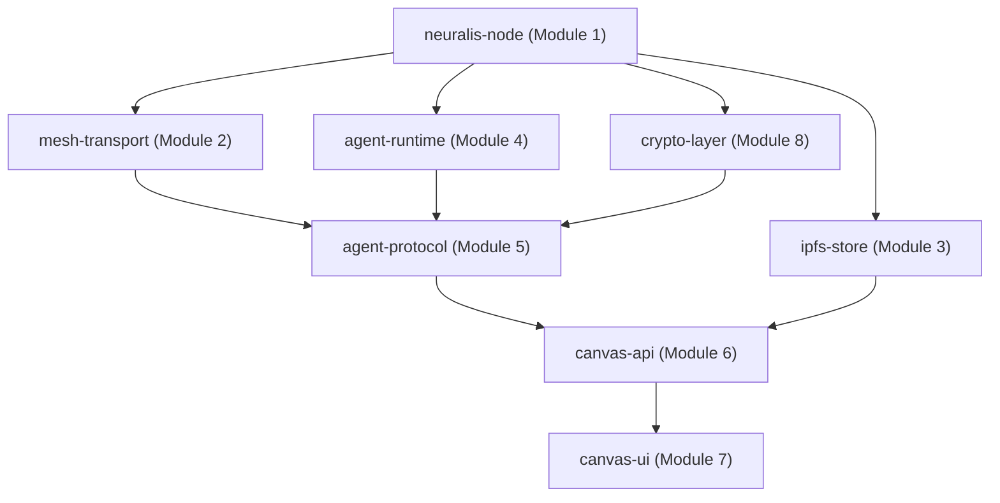

# Neuralis — Contributor Guide

**Document Version:** `0.9.0-BETA`  
**Date:** 2026-03-10

---

## Welcome to the Neuralis Mesh

Neuralis is a collaborative effort to build a decentralized, privacy-first AI compute network. We hold our contributors to a high standard: write code that is **correct**, **secure**, and **maintainable**. Every module you touch will eventually run on nodes controlled by people who trust the network with sensitive workloads.

---

## 1. Development Environment Setup

### 1.1 Nix Shell (`shell.nix`)

> [!NOTE]
> **Current Bottleneck**: A root-level `shell.nix` was not located in the repository at the time of this audit. Module-level `pyproject.toml` files define per-module Python dependencies. If a `shell.nix` is added in the future, this section should be updated.

The intended workflow using Nix:

```bash
# Entering the reproducible dev environment
nix-shell               # uses shell.nix in the project root
# Or for a specific module:
cd crypto-layer && nix-shell

# Inside the nix shell, all tools are available:
python --version        # Pinned Python version
pytest --version        # Test runner
black --version         # Formatter
```

**Why Nix?** Nix provides a fully reproducible build environment. Every developer, CI runner, and staging node uses the same Python version and library set. This eliminates "works on my machine" defects — especially critical for a cryptographic codebase.

### 1.2 Manual Setup (without Nix)

If a `shell.nix` is not yet available, use the per-module `pyproject.toml`:

```bash
# 1. Create and activate a virtual environment (per module)
cd neuralis-node
python -m venv .venv && source .venv/bin/activate

# 2. Install the module in editable mode with its dev dependencies
pip install -e ".[dev]"

# 3. For modules that depend on other Neuralis modules (e.g., crypto-layer),
#    install local dependencies in editable mode first:
pip install -e ../neuralis-node   # crypto-layer depends on neuralis-node
pip install -e .
```

### 1.3 Running All Tests

Each module has its own `tests/` directory. Always set `PYTHONPATH` to include sibling module source directories:

```bash
# Testing mesh-transport (depends on neuralis-node)
PYTHONPATH=./neuralis-node:./mesh-transport \
    pytest mesh-transport/tests/ -v

# Testing crypto-layer (depends on neuralis-node)
PYTHONPATH=./neuralis-node:./crypto-layer \
    pytest crypto-layer/tests/ -v

# Testing agent-protocol (depends on neuralis-node, agent-runtime, mesh-transport)
PYTHONPATH=./neuralis-node:./mesh-transport:./agent-runtime:./agent-protocol \
    pytest agent-protocol/tests/ -v
```

---

## 2. Module Architecture and Dependency Graph

Contributors must understand the module dependency order to avoid circular imports and to correctly set `PYTHONPATH` for testing:



**Rule**: Only depend on modules that are _above_ you in this graph. Never introduce circular dependencies.

---

## 3. Code Standards

### 3.1 Python Standards

| Standard           | Rule                                                                                                                          |
| :----------------- | :---------------------------------------------------------------------------------------------------------------------------- |
| **Type Hints**     | Mandatory on all public methods and class attributes. Use `from __future__ import annotations` in every file.                 |
| **Docstrings**     | NumPy-style docstrings for all public classes and methods. Include `Parameters`, `Returns`, and `Raises` sections.            |
| **Async/Await**    | All I/O operations must be `async`. **Never call blocking functions** (e.g., `open()`, `time.sleep()`) in `async` code.       |
| **Error Handling** | Define module-specific exception classes (e.g., `TokenError`, `EnvelopeError`). Raise typed exceptions, not bare `Exception`. |
| **Formatting**     | `black` with default settings. Run before every commit.                                                                       |
| **Linting**        | `ruff` for fast linting. Zero warnings policy.                                                                                |

### 3.2 Security Code Standards

> [!CAUTION]
> Never use `==` for comparing secrets (HMAC digests, tokens). Always use `hmac.compare_digest()` to prevent timing attacks.

```python
# ❌ WRONG — timing side-channel
if computed_sig == provided_sig:
    pass

# ✅ CORRECT — constant-time comparison
import hmac
if hmac.compare_digest(computed_sig, provided_sig):
    pass
```

> [!CAUTION]
> Never log private key bytes, HMAC keys, or raw session keys. Only log key IDs (hex prefixes).

### 3.3 Testing Standards

All cryptographic code requires **minimum 80% test coverage**.

```bash
# Run tests with coverage report
pytest --cov=neuralis.crypto --cov-report=term-missing crypto-layer/tests/
```

**Required test categories:**

| Category           | Requirement                                            |
| :----------------- | :----------------------------------------------------- |
| **Happy path**     | Core functionality succeeds                            |
| **Negative path**  | Invalid inputs raise typed exceptions                  |
| **Replay tests**   | Stale/replayed messages are rejected                   |
| **Tamper tests**   | Any bit-flip in ciphertext causes auth failure         |
| **Rotation tests** | Key rotation succeeds and old keys are retired cleanly |

---

## 4. Contributing to the Backend (Python Modules)

### 4.1 Feature Development Workflow

```
1.  Fork the repository on GitHub.
2.  Create a branch:  git checkout -b feat/module8-zk-proofs
3.  Write tests FIRST (test-driven development preferred).
4.  Implement the feature in the correct module.
5.  Ensure all tests pass.
6.  Run the linter: ruff check . && black --check .
7.  Create a Pull Request with:
    - A description of "Why" and "How"
    - A reference to the relevant roadmap item or issue number
    - Test coverage report attached
```

### 4.2 Module 8 Status — Bug Fixing Guide

The active work on **Module 8** (`crypto-layer`) involves:

- **F-01**: Address the 300-second replay window with a nonce bloom filter.
- **F-02**: Refactor `Signer.from_node()` to not access `_private_key` directly — route through `NodeIdentity.sign()`.
- **F-03**: Add HMAC key rotation grace period (60s overlap buffer).
- **F-04**: Scaffold `neuralis.crypto.proofs` — the ZK proof implementation module (see `MODULE_8_SECURITY_AUDIT.md` for architecture).

---

## 5. Contributing to the Frontend (`canvas-ui`)

The `canvas-ui` is a **React + Vite** application using **TailwindCSS**.

### 5.1 Setup

```bash
cd canvas-ui
npm install
npm run dev   # Starts the Vite dev server
```

### 5.2 Component Conventions

| Convention           | Detail                                                                               |
| :------------------- | :----------------------------------------------------------------------------------- |
| **State management** | Use the `useNodeState` hook for all API data. Do not fetch directly from components. |
| **WebSocket**        | Use the `useWebSocket` hook for real-time event log updates.                         |
| **API calls**        | All calls go through `lib/api.js`. Never write `fetch()` inline in components.       |
| **Style**            | TailwindCSS utility classes. Do not write inline CSS.                                |

### 5.3 Component Map

```
src/components/
├── Canvas.jsx         # Root layout, composites all panels
├── NodePanel.jsx      # Local node identity, status, CID info
├── PeerPanel.jsx      # Connected peers + latency table
├── AgentPanel.jsx     # Running agents, invoke UI
├── ContentPanel.jsx   # IPFS content browser
├── DetailPanel.jsx    # Detail/side-panel for selected item
├── EventLog.jsx       # Real-time protocol event stream
├── LoadingScreen.jsx  # Node initialization loading state
└── StatusBar.jsx      # Global status: connected/disconnected
```

---

## 6. Roadmap and Module Status

| Module | Name                                | Status        | Owner          |
| :----- | :---------------------------------- | :------------ | :------------- |
| 1      | Node Identity (`neuralis-node`)     | 🟢 STABLE     | Core Team      |
| 2      | Mesh Transport (`mesh-transport`)   | 🟢 STABLE     | Core Team      |
| 3      | IPFS Storage (`ipfs-store`)         | 🟢 STABLE     | Core Team      |
| 4      | Agent Runtime (`agent-runtime`)     | 🟢 STABLE     | Agent Team     |
| 5      | Protocol Router (`agent-protocol`)  | 🟡 BETA       | Protocol Team  |
| 6      | Canvas API (`canvas-api`)           | 🟡 BETA       | API Team       |
| 7      | Canvas UI (`canvas-ui`)             | 🟡 BETA       | UI Team        |
| 8      | Crypto Layer (`crypto-layer`)       | 🔴 BUG FIXING | Security Team  |
| 9      | Erasure Coding (Shard Distribution) | ⬜ PLANNED    | Storage Team   |
| 10     | Tokenomics / Credits Engine         | ⬜ PLANNED    | Economics Team |

---

## 7. Communication Channels

| Channel                | Purpose                           |
| :--------------------- | :-------------------------------- |
| **GitHub Issues**      | Bug reports, feature requests     |
| **GitHub Discussions** | Architecture proposals, RFCs      |
| **Discord**            | Async collaboration, dev chat     |
| **Weekly Sync**        | Every Tuesday — module leads only |

---

> _"Build with precision. Ship with integrity. The mesh depends on it."_

---

_End of Contributor Guide | Neuralis v0.9.0-BETA_
