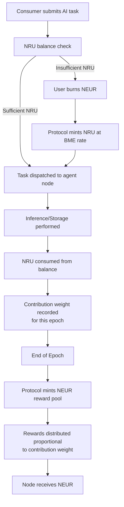
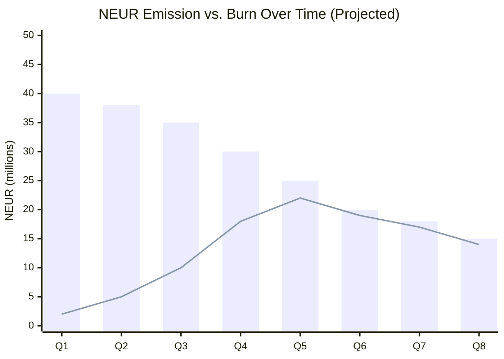
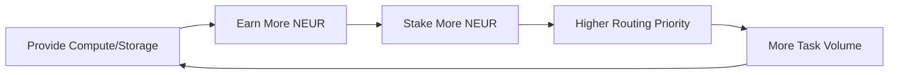

# Neuralis — DePIN Economics & Tokenomics

**Document Version:** `0.9.0-BETA`  
**Date:** 2026-03-10  
**Author:** Protocol Economics Team

---

## Executive Summary

Neuralis is a **Decentralized Physical Infrastructure Network (DePIN)** for AI compute and storage. Its economic model is engineered around a **Burn-and-Mint Equilibrium (BME)**, a dual-token architecture designed to align incentives between three classes of participants: **Compute Providers**, **Storage Providers**, and **AI Consumers**.

The core invariant of the system: _as utility demand increases, circulating supply contracts, creating sustainable economic pressure that rewards long-term node operators over speculative holders._

---

## 1. Dual Token Architecture

### 1.1 `$NEUR` — Native Protocol Token

`$NEUR` is the **primary liquid, tradable asset** of the Neuralis ecosystem.

| Property               | Value                                                  |
| :--------------------- | :----------------------------------------------------- |
| **Type**               | Layer-1 / Bridged DeFi asset                           |
| **Utility**            | Staking (node operation), Governance, Burn-for-credits |
| **Minting**            | Fixed epoch-based emissions (by the protocol)          |
| **Supply Contraction** | Via user burn events (demand-driven)                   |

**Primary use cases:**

- Stake `$NEUR` to register as a compute or storage node.
- Burn `$NEUR` to receive `$NRU` (resource credits).
- Vote on protocol governance proposals (treasury, fee parameters).

### 1.2 `$NRU` — Neural Resource Unit

`$NRU` is a **non-tradable, non-transferable credit unit** used internally to denominate infrastructure consumption.

| Property    | Value                                                           |
| :---------- | :-------------------------------------------------------------- |
| **Type**    | In-protocol credit (off-chain ledger initially)                 |
| **Utility** | Price unit for compute, storage, and bandwidth                  |
| **Source**  | Minted by burning `$NEUR` at a protocol-defined exchange rate   |
| **Sink**    | Consumed per inference token, per MB stored, per GB transferred |

**Example pricing schedule (target):**

| Resource                            | Cost    |
| :---------------------------------- | :------ |
| 1,000 inference tokens (Mistral-7B) | 1 NRU   |
| 1 GB storage per epoch              | 0.5 NRU |
| 100 MB data transfer                | 0.1 NRU |

---

## 2. Burn-and-Mint Equilibrium (BME)

The BME mechanism ensures that the token economy is **self-regulating**: when demand for AI services rises, more `$NEUR` is burned (supply contracts), and more `$NRU` enters the system. When demand falls, fewer burns occur and the fixed-emission schedule gradually re-inflates the circulating supply.

### 2.1 Epoch Cycle



### 2.2 The BME Exchange Rate

The burn rate `R_burn` (NEUR per NRU) is not fixed forever — it is governed by a protocol parameter subject to DAO vote. The initial target rate:

```
1 NEUR → 100 NRU
```

This rate is adjusted to maintain a target **utilization ratio** `U`:

```
U = total_NRU_burned_epoch / total_NRU_minted_epoch

if U > U_target:  R_burn increases   (NRU more expensive → burns more NEUR)
if U < U_target:  R_burn decreases   (NRU cheaper → stimulates demand)
```

### 2.3 Emission Schedule



_Bar = Emissions (decreasing schedule). Line = Burns (rising with adoption)._

---

## 3. Incentive Alignment: How the Network Stays Alive

The fundamental problem of DePIN is the coordination failure between infrastructure supply and application demand. Neuralis addresses this through **three interlocking feedback loops**:

### Loop 1: The Productive Node Loop

> _Nodes that provide more compute/storage earn more `$NEUR`. More `$NEUR` means more staking power, which means more routing preference, which means more tasks, which means more rewards._



### Loop 2: The Demand Flywheel

> _Better AI models attract more users. More users burn more `$NEUR`. More burns mean less circulating supply. Less supply means higher `$NEUR` price. Higher price attracts more node operators._

### Loop 3: The Governance Equilibrium

> _Token holders vote on BME parameters. Bad parameters (e.g., too-cheap NRU) trigger over-consumption and supply collapse. The DAO is collectively incentivized to find sustainable equilibrium._

---

## 4. Resource Management — Code Integration Status

The `config.py` in `neuralis-node` contains references to storage quotas and credit accounting:

```python
@dataclass
class StorageConfig:
    data_dir: str = "~/.neuralis/data"
    max_storage_gb: float = 10.0   # Node's local storage cap
    gc_interval_hours: float = 24.0

@dataclass
class AgentConfig:
    # ...
    max_concurrent_tasks: int = 4  # Resource throttle
```

These parameters form the **physical constraint layer**. The economic layer — which converts these physical resources into NRU charges and NEUR rewards — is the **Planned Architecture** integration point.

> [!IMPORTANT]
> **Current State**: The `$NRU` credit deduction and `$NEUR` reward distribution logic has not yet been written into the `agent-runtime` or `agent-protocol` modules. The codebase establishes all necessary hooks (capability tokens, task routing, resource monitoring), but the on-chain and in-process economic settlement layer is a **Planned Architecture** item.

---

## 5. Implementation Roadmap for Economics

| Phase                    | Item                                          | Dependency            |
| :----------------------- | :-------------------------------------------- | :-------------------- |
| **Phase 1** (Current)    | Identity, Transport, Storage, Agent Runtime   | ✅ Complete           |
| **Phase 2** (Bug Fixing) | Module 8 crypto: ZK proofs, token integration | 🔲 In Progress        |
| **Phase 3** (Next)       | NRU credit ledger in `agent-runtime`          | Module 8 ZK proofs    |
| **Phase 4**              | On-chain settlement (Solana/EVM bridge)       | Phase 3 credit ledger |
| **Phase 5**              | DAO governance module                         | Phase 4 on-chain      |

---

_Neuralis: Aligning economic incentives with computational utility._
