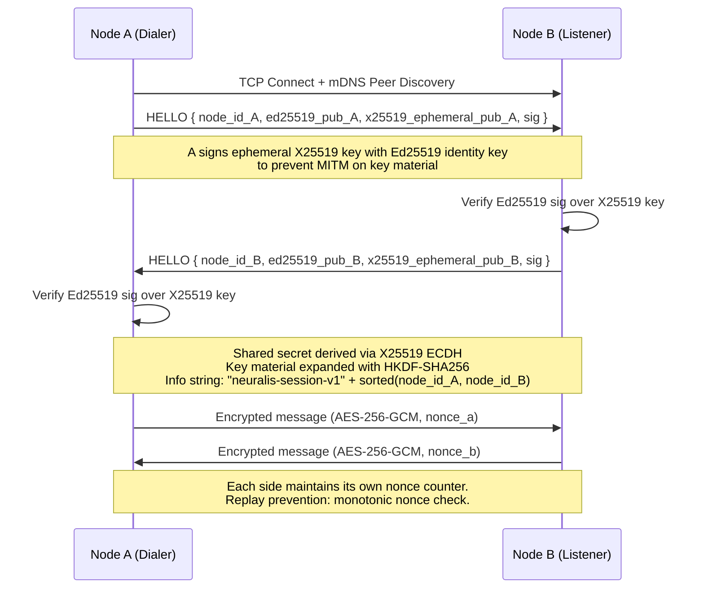
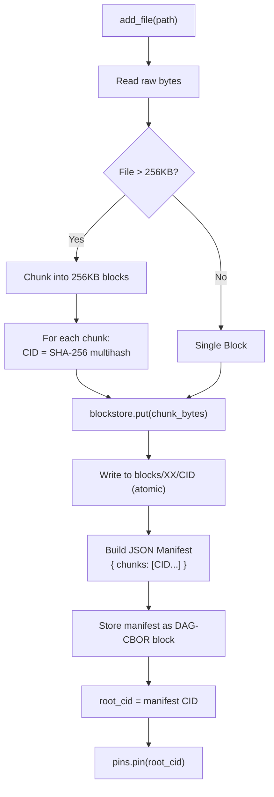
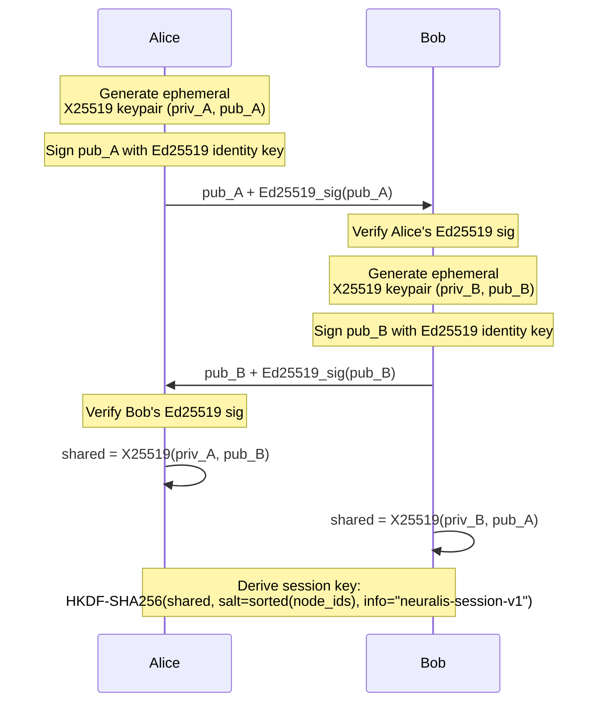
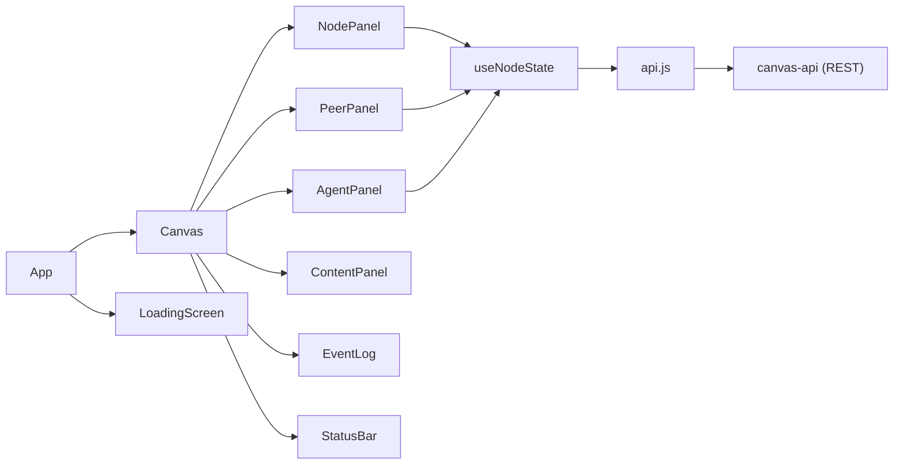

# Neuralis — Full Technical Specification

**Document Version:** `0.9.0-BETA`  
**Audit Date:** 2026-03-10  
**Author:** Principal Architecture Team  
**Scope:** Complete system design, data lifecycle, and security architecture.

---

## Codebase Structure (Verified)

```
Neuralis/
├── README.md
├── neuralis-node/          # Module 1: Node Identity & Lifecycle
│   └── neuralis/
│       ├── identity.py     # Ed25519 keypair management + NodeID derivation
│       ├── config.py       # Layered config (defaults → file → env vars)
│       ├── node.py         # Node lifecycle and subsystem registry
│       └── mesh/           # mDNS discovery, host, peer management
├── mesh-transport/         # Module 2: Layer-2 P2P Transport
│   └── neuralis/mesh/
│       ├── transport.py    # X25519 session encryption
│       ├── peers.py        # PeerStore + PeerInfo
│       └── host.py         # MeshHost: listener + dialer
├── crypto-layer/           # Module 8: Application Cryptography
│   └── neuralis/crypto/
│       ├── signing.py      # Ed25519 Signer/Verifier
│       ├── exchange.py     # X25519 ECDH KeyExchange
│       ├── envelope.py     # Sealed envelopes (AES-256-GCM + Ed25519)
│       ├── keystore.py     # Fernet-encrypted key persistence + rotation
│       └── tokens.py       # HMAC-SHA256 Capability Tokens
├── ipfs-store/             # Module 3: Content-Addressable Storage
│   └── neuralis/store/
│       ├── blockstore.py   # Sharded flat-file CID→block store
│       ├── ipfs_store.py   # High-level add/get/pin/gc interface
│       ├── pins.py         # PinManager (pinned CID ledger)
│       └── cid.py          # CID derivation (SHA-256 multihash)
├── agent-runtime/          # Module 4: Local Agent Execution
│   └── neuralis/agents/
│       ├── inference.py    # llama-cpp-python GGUF inference engine
│       ├── loader.py       # Plugin-based agent discovery
│       ├── bus.py          # In-process pub/sub (AgentBus)
│       └── runtime.py      # AgentRuntime orchestrator
├── agent-protocol/         # Module 5: Inter-Node Routing
│   └── neuralis/protocol/
│       ├── messages.py     # ProtocolMessage wire format
│       └── router.py       # ProtocolRouter: capability management + routing
├── canvas-api/             # Module 6: FastAPI Control Plane
│   └── neuralis/api/
│       ├── routes.py       # REST endpoints
│       ├── models.py       # Pydantic request/response schemas
│       └── app.py          # FastAPI app factory
└── canvas-ui/              # Module 7: React Dashboard
    └── src/
        ├── components/     # AgentPanel, Canvas, NodePanel, PeerPanel…
        ├── hooks/          # useNodeState, useWebSocket
        └── lib/            # api.js, utils.js
```

---

## 1. Protocol Overview: Peer Discovery and NAT Traversal

### 1.1 mDNS-Based Local Discovery

Neuralis uses **Multicast DNS (mDNS)** for zero-configuration node discovery on local networks. A node coming online broadcasts a specifically structured mDNS probe packet; other nodes on the same segment parse it and add it to their `PeerStore`.

A parsed probe yields a `PeerInfo` object:

```
PeerInfo {
    node_id:    "NRL1a1b2c3d4e5f6..."  — 16-char hex suffix of SHA-256(pubkey)
    peer_id:    "<libp2p multihash>"    — libp2p-compatible identifier
    addresses:  ["192.168.1.x:9000"]
    public_key: "<hex Ed25519 pubkey>"
    last_seen:  <unix timestamp>
    last_ping_ms: <float>
}
```

### 1.2 Gossip Protocol and Peer Propagation

For cross-subnet discovery (beyond mDNS range), Neuralis will implement **GossipSub**. Under GossipSub, each node maintains a partial view of the mesh and propagates `PEER_ANNOUNCE` messages with a configurable fanout factor.

> [!NOTE]
> **Current State**: The `PeerStore` correctly manages local peers. GossipSub propagation is a **Planned Architecture** item. The `hosts.py` layer provides the listener and dialer abstractions that GossipSub will wire into.

### 1.3 NAT Traversal

> [!NOTE]
> **Current Bottleneck**: Direct NAT hole-punching (STUN/ICE) is not yet implemented. Nodes currently assume direct TCP/UDP reachability. A relay protocol (similar to libp2p Circuit Relay) is on the roadmap.

### 1.4 Transport Handshake: Full Flow



---

## 2. Data Lifecycle: File Storage and Distribution

### 2.1 Ingestion and Chunking

When a file is added via `IPFSStore.add_file()`, the following chunking pipeline runs:

1. **Read** the raw file bytes from disk.
2. **Slice** into sequential 256KB (`CHUNK_SIZE = 262144`) blocks.
3. For each chunk, compute **CID** = `b"b" + base64.b32encode(sha256(chunk))`.
4. **Atomically write** each chunk to disk: `blocks/<shard>/<cid>`.
   - Shard key = `cid_str[1:3]` (characters 2 and 3 of the CID string, skipping the `b` prefix), yielding up to 1,024 shards.
   - Atomic write strategy: write to `.tmp` file, then `os.replace()`.

### 2.2 DAG Assembly (Manifest)

After all chunks are stored, a JSON manifest is created:

```json
{
  "name": "myfile.bin",
  "size": 1048576,
  "chunks": ["bABCD...", "bEFGH...", "bIJKL..."],
  "codec": "DAG_CBOR"
}
```

This manifest is itself stored as a block (encoded as `Codec.DAG_CBOR`) and becomes the **root CID** — the single identifier that represents the entire file.

### 2.3 Data Flow Diagram



### 2.4 Encryption at the Envelope Layer

Block storage itself is currently **plaintext** at the blockstore level — encryption is a responsibility of the transport/envelope layer. Data is protected in transit via `SealedEnvelope` (AES-256-GCM).

> [!IMPORTANT]
> **Planned Architecture:** At-rest encryption for blocks is a roadmap item. The current separation of concerns (transport security vs storage security) is intentional to allow non-sensitive public content to be shared without overhead.

### 2.5 Erasure Coding

> [!NOTE]
> **Current Bottleneck**: Erasure coding (Reed-Solomon) is documented in the `README.md` as a target feature. The current implementation stores **whole block replicas**. The `blockstore.py` sharding (by CID prefix characters) is a filesystem organizational strategy, **not** RS erasure coding. Full RS-based fault-tolerant distribution is a **Planned Architecture** item targeted for Module 9.

### 2.6 Garbage Collection

The `GC` subsystem uses a mark-and-sweep strategy:

1. **Mark**: Query `PinManager` for all recursively pinned CIDs.
2. **Sweep**: Enumerate all CIDs in the blockstore; delete those absent from the pin set.
3. Returns the count of deleted blocks.

---

## 3. Security Architecture

### 3.1 Node Identity: Ed25519

Every Neuralis node is uniquely identified by an **Ed25519** keypair.

| Property            | Value                                                    |
| :------------------ | :------------------------------------------------------- |
| Algorithm           | Ed25519 (RFC 8032)                                       |
| Library             | `cryptography.hazmat.primitives.asymmetric.ed25519`      |
| Key size            | 32-byte private key, 32-byte public key                  |
| Node ID format      | `NRL1` + first 16 chars of `hex(sha256(pubkey_bytes))`   |
| Peer ID format      | libp2p multihash encoding (SHA-256)                      |
| Private key storage | Fernet(PBKDF2(passphrase)) in `~/.neuralis/identity.key` |

### 3.2 X25519 Key Exchange

The transport and envelope layers both utilize **X25519 Elliptic Curve Diffie-Hellman** for shared secret derivation.



### 3.3 AES-256-GCM Authenticated Encryption

All application-layer payload encryption uses **AES-256-GCM** (Authenticated Encryption with Associated Data, AEAD).

- **Key**: 32 bytes derived from HKDF.
- **Nonce**: 12 bytes of cryptographically random data (`os.urandom(12)`).
- **AAD (Additional Authenticated Data)**: Binds the ciphertext to the _immutable_ envelope header (`envelope_id:sender_id:recipient_id`). Any header tampering causes GCM authentication to fail.
- **Tag**: 16-byte GCM authentication tag is appended to the ciphertext (provides integrity + authenticity).

---

## 4. Canvas API and UI Interface

### 4.1 REST API Surface (`canvas-api`)

| Endpoint                       | Method | Description                       |
| :----------------------------- | :----- | :-------------------------------- |
| `/api/v1/status`               | GET    | Node status, uptime, peer count   |
| `/api/v1/peers`                | GET    | List known peers with latency     |
| `/api/v1/peers/{id}/connect`   | POST   | Manually initiate peer connection |
| `/api/v1/content`              | POST   | Upload content to IPFS store      |
| `/api/v1/content/{cid}`        | GET    | Retrieve content by CID           |
| `/api/v1/agents`               | GET    | List running agents               |
| `/api/v1/agents/{name}/invoke` | POST   | Invoke a local agent              |
| `/api/v1/tasks`                | POST   | Route a task to a remote agent    |

### 4.2 Canvas UI Component Map



---

_Document generated: 2026-03-10 | Source-of-truth for Neuralis v0.9.0-BETA_
