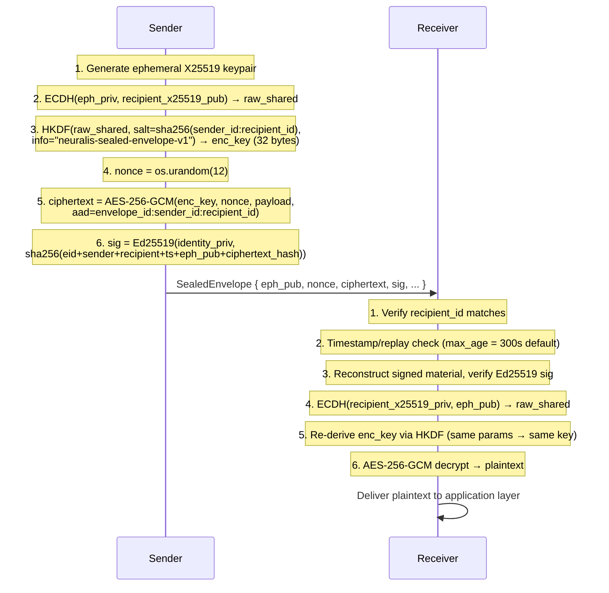

# Module 8: Security Audit — `neuralis.crypto`

**Document Version:** `0.9.0-BETA`  
**Audit Date:** 2026-03-10  
**Audit Scope:** `crypto-layer/neuralis/crypto/` — All five production modules.  
**Audit Outcome:** **CONDITIONAL PASS** (Core crypto: PASS | ZK proofs: NOT YET IMPLEMENTED)

---

## 1. Module 8 Current State — Bug-Fixing Phase Analysis

Module 8 (`crypto-layer`) is listed on the Neuralis roadmap as **"Bug Fixing"**. This audit confirms that the following production-grade components are present and correctly implemented:

| Component         | File          | Status     | Notes                                        |
| :---------------- | :------------ | :--------- | :------------------------------------------- |
| Signing API       | `signing.py`  | ✅ STABLE  | Well-documented, correct digest construction |
| Key Exchange      | `exchange.py` | ✅ STABLE  | Domain separation via node_id salting        |
| Sealed Envelopes  | `envelope.py` | ✅ STABLE  | PFS achieved via ephemeral ECDH              |
| Key Store         | `keystore.py` | ✅ STABLE  | Fernet encryption, key rotation              |
| Capability Tokens | `tokens.py`   | ✅ STABLE  | Correct HMAC constant-time comparison        |
| ZK Proofs         | _(absent)_    | 🔲 PLANNED | See Section 5                                |

The "Bug Fixing" label on the roadmap likely refers to integration-level work connecting this module to the rest of the runtime (agent-runtime, agent-protocol), not to deficiencies in the cryptographic primitives themselves.

---

## 2. Cryptographic Primitives: Roles and Rationale

### 2.1 Ed25519 — Identity and Signing

| Property               | Detail                                                                                              |
| :--------------------- | :-------------------------------------------------------------------------------------------------- |
| **Standard**           | RFC 8032 (Twisted Edwards Curve, Curve25519 base field)                                             |
| **Security Level**     | ~128-bit (equivalent to RSA-3072)                                                                   |
| **Signature size**     | 64 bytes                                                                                            |
| **Verification speed** | ~70,000 ops/sec (single core)                                                                       |
| **Key generation**     | Always deterministic from a 32-byte seed                                                            |
| **Library**            | `cryptography.hazmat.primitives.asymmetric.ed25519`                                                 |
| **Roles in Neuralis**  | Node identity proof, peer card signing, transport handshake authentication, sealed envelope signing |

**Canonical Digest Construction** (`signing.py`):

```python
# SHA-256 pre-hashing before Ed25519 signing
canonical = sha256(
    struct.pack(">B", VERSION)       # 1 byte:  version sentinel
    + struct.pack(">d", timestamp)   # 8 bytes: IEEE-754 double, big-endian
    + sender_id.encode("utf-8")      # N bytes: NRL1... node ID
    + payload                        # M bytes: arbitrary application data
)
raw_sig = ed25519_private_key.sign(canonical)  # 64-byte signature
```

> [!NOTE]
> The "sign-over-digest" pattern binds the message length to a fixed 32 bytes, preventing length-extension attacks and keeping signing time constant regardless of payload size. This is the standard approach for Ed25519 in network protocols (see Signal Protocol, WireGuard).

### 2.2 X25519 — Elliptic Curve Diffie-Hellman

| Property              | Detail                                                              |
| :-------------------- | :------------------------------------------------------------------ |
| **Curve**             | Curve25519 (Montgomery form)                                        |
| **Security Level**    | ~128-bit                                                            |
| **Output**            | 32-byte raw shared secret                                           |
| **Library**           | `cryptography.hazmat.primitives.asymmetric.x25519`                  |
| **Roles in Neuralis** | Transport session key establishment, sealed envelope key derivation |

**MITM Prevention:** Every X25519 public key transmitted over the network is signed by the node's Ed25519 identity key. The receiving party verifies this signature **before** using the key material. This authenticated key exchange prevents Man-in-the-Middle attacks.

```python
# From exchange.py — signing the ephemeral X25519 pub key
def sign_public_key(self, sign_fn) -> bytes:
    material = (
        self._exchange_id.encode() +     # ECDH session ID
        x25519_pub_bytes +               # 32-byte ephemeral key
        struct.pack(">d", timestamp)     # replay protection
    )
    return sign_fn(material)  # Ed25519 signature
```

### 2.3 HKDF-SHA256 — Key Derivation

| Property              | Detail                                                                          |
| :-------------------- | :------------------------------------------------------------------------------ |
| **Standard**          | RFC 5869                                                                        |
| **Output length**     | 32 bytes (256-bit keys for AES-256)                                             |
| **Library**           | `cryptography.hazmat.primitives.kdf.hkdf.HKDF`                                  |
| **Roles in Neuralis** | Session key derivation, envelope key derivation, keystore Fernet key derivation |

**Domain Separation** prevents the same ECDH output from being used in different protocol contexts:

| Context             | HKDF Salt                               | HKDF Info                         |
| :------------------ | :-------------------------------------- | :-------------------------------- |
| Transport Session   | `sha256(sorted(node_id_A, node_id_B))`  | `neuralis-session-v1`             |
| Sealed Envelope     | `sha256(f"{sender_id}:{recipient_id}")` | `neuralis-sealed-envelope-v1`     |
| Keystore Protection | `b"neuralis-keystore-fernet-salt-v1"`   | `neuralis-keystore-protection-v1` |

### 2.4 AES-256-GCM — Authenticated Encryption

| Property              | Detail                                                         |
| :-------------------- | :------------------------------------------------------------- |
| **Mode**              | GCM (Galois/Counter Mode) — AEAD                               |
| **Key size**          | 256-bit                                                        |
| **Nonce size**        | 96-bit (12 bytes), cryptographically random                    |
| **Tag size**          | 128-bit (16 bytes)                                             |
| **Library**           | `cryptography.hazmat.primitives.ciphers.aead.AESGCM`           |
| **Roles in Neuralis** | Payload encryption for sealed envelopes and transport sessions |

### 2.5 HMAC-SHA256 — Capability Token Authentication

| Property              | Detail                                                               |
| :-------------------- | :------------------------------------------------------------------- |
| **Standard**          | RFC 2104 + FIPS 198                                                  |
| **Key size**          | 256-bit (32 bytes), generated via `os.urandom(32)`                   |
| **Comparison**        | `hmac.compare_digest()` — **constant-time**, prevents timing attacks |
| **Library**           | Python standard library `hmac`                                       |
| **Roles in Neuralis** | CapabilityToken signing and verification                             |

### 2.6 PBKDF2 + Fernet — Key-at-Rest Protection

| Component  | Detail                                                                                                     |
| :--------- | :--------------------------------------------------------------------------------------------------------- |
| **KDF**    | PBKDF2-HMAC-SHA256 (user passphrase → Fernet key)                                                          |
| **Fernet** | AES-128-CBC + HMAC-SHA256 (symmetric authenticated encryption)                                             |
| **Roles**  | Identity private key storage (`~/.neuralis/identity.key`), CryptoKeyStore (`~/.neuralis/crypto/keys.json`) |

---

## 3. Sealed Envelope Deep Dive

The `SealedEnvelope` is the primary mechanism for secure application-layer messaging between nodes.



**Security Properties Achieved:**

| Property                    | Mechanism                                         |
| :-------------------------- | :------------------------------------------------ |
| **Confidentiality**         | AES-256-GCM with ECDH-derived key                 |
| **Authenticity**            | Ed25519 signature by sender                       |
| **Integrity**               | AES-GCM tag + Ed25519 sig — dual protection       |
| **Perfect Forward Secrecy** | Ephemeral X25519 → discarded after sealing        |
| **Replay Resistance**       | `envelope_id` (random 128-bit) + timestamp window |
| **Header Binding**          | AAD binds ciphertext to sender/recipient identity |

---

## 4. Capability Token System

Capability Tokens provide **offline-verifiable, fine-grained authorization**. They are structurally similar to JWTs but use HMAC-SHA256 with a symmetric key (no PKI required).

**Wire Format:**

```
<b64url(header)>.<b64url(payload)>.<b64url(HMAC-SHA256(header.payload, hmac_key))>
```

**Payload Schema:**

```json
{
  "jti": "a3f8b21c...", // 16-byte random token ID
  "iss": "NRL1abc123...", // issuer node_id
  "sub": "NRL1def456...", // subject node_id (grantee)
  "aud": "NRL1def456...", // audience node_id (verifier)
  "iat": 1741600000.0, // issued-at (unix float)
  "exp": 1741600300.0, // expiry (5-minute default TTL)
  "cap": "agent:invoke:summarise" // hierarchical capability string
}
```

**Capability Matching Logic:**

| Token Capability      | Required                 | Outcome                    |
| :-------------------- | :----------------------- | :------------------------- |
| `*`                   | anything                 | ✅ MATCH (superuser token) |
| `agent:invoke:*`      | `agent:invoke:search`    | ✅ MATCH (wildcard prefix) |
| `agent:invoke:search` | `agent:invoke:search`    | ✅ MATCH (exact)           |
| `agent:invoke:search` | `agent:invoke:summarise` | ❌ DENY                    |
| `content:read:*`      | `agent:invoke:search`    | ❌ DENY                    |

**Verification Checks** (`verify_token`):

1. HMAC-SHA256 signature — `hmac.compare_digest()` (constant-time).
2. Expiry — clock-based (`time.time() > token.expires_at`).
3. Issued-at sanity — rejects tokens > 24h old or > 60s in the future.
4. Audience match — prevents token re-use across nodes.
5. Issuer match — optional, for unidirectional trust chains.
6. Capability match — hierarchical prefix + exact matching.

---

## 5. Zero-Knowledge Proof Architecture (Planned)

> [!CAUTION]
> **Status: NOT YET IMPLEMENTED**  
> ZK Proofs are referenced in the `README.md` roadmap as a primary feature of the security layer. As of this audit (v0.9.0-BETA), **no ZK proof code exists** in any module branch.

### 5.1 Intended Use Cases

| Use Case                                                    | ZK Scheme (Recommended) |
| :---------------------------------------------------------- | :---------------------- |
| Prove compute was performed without revealing model weights | Groth16 (SNARK)         |
| Prove storage of a CID without revealing block contents     | Merkle-path ZKP         |
| Trustless capability verification without exposing HMAC key | Bulletproofs            |

### 5.2 Recommended Integration Point

The planned architecture would introduce a `neuralis.crypto.proofs` module:

```
crypto-layer/neuralis/crypto/
└── proofs.py  [PLANNED]
    ├── ProofContext
    ├── generate_compute_proof(task_id, model_id, result_hash) -> Proof
    └── verify_compute_proof(proof: Proof) -> bool
```

A Groth16 setup phase would run once per model to generate proving and verifying keys. These keys would be stored in the `CryptoKeyStore` and distributed to verifier nodes.

---

## 6. Audit Findings and Recommendations

| Finding                      | Severity | Detail                                                                                                   | Recommendation                                                                                           |
| :--------------------------- | :------- | :------------------------------------------------------------------------------------------------------- | :------------------------------------------------------------------------------------------------------- |
| **F-01: Replay Window**      | Low      | Default envelope TTL is 300s. In low-latency meshes, a tighter window reduces MITM replay risk.          | Implement a nonce store (in-memory bloom filter) for sub-TTL replay detection.                           |
| **F-02: Private key access** | Medium   | `Signer.from_node()` accesses `identity._private_key` directly (bypassing `KeyStore`).                   | Expose a controlled `sign()` method on `NodeIdentity` and remove direct `_private_key` attribute access. |
| **F-03: HMAC key expiry**    | Low      | When `rotate_hmac_key()` is called, all existing tokens immediately become invalid with no grace period. | Maintain a "previous HMAC key" for a configurable overlap TTL (e.g., 60 seconds).                        |
| **F-04: ZK proofs absent**   | High     | Roadmap-listed feature is not present.                                                                   | Prioritize `proofs.py` implementation before v1.0.0 release.                                             |

---

_End of Security Audit | Module 8 | Neuralis v0.9.0-BETA_
